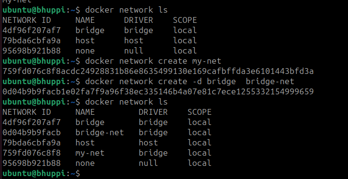

# Docker Networking
#### `Container networking refers to the ability for containers to connect to and communicate with each other, or to non-Docker workloads.`

Container networking is like giving containers the ability to talk to each other or to things outside of themselves, kind of like how your phone can connect to the internet. When containers talk to each other, they don't really know if they're talking to other containers or something else. All they see is an address (like an IP address), a gateway (a way to connect to other networks), and some other technical details that help them communicate. It's like containers have their own little internet world where they can send messages and do things together.


# Docker Network Drivers 

### 1. Bridge Driver
  #### Default Bridge
- **Description:** Default network driver enabling communication between containers on the same host.
#### Custom Bridge
- **Description:** Like the default bridge, a custom bridge provides network isolation for containers on the same host.


### 2. Host Driver

- **Description:** Removes network isolation, allowing containers to share the host's network namespace.

### 3. Overlay Driver

- **Description:** Facilitates communication between containers across multiple Docker hosts, creating a virtual network overlay.

### 4. Macvlan Driver

- **Description:** Assigns a MAC address to each container, making it appear as a physical device on the network.

### 5. None Driver

- **Description:** Disables all networking for the container, providing complete isolation.

### 6. ipvlan Driver
- **Description:** IPvlan networks provide full control over both IPv4 and IPv6 addressing.

# Lets do some Hands-on 
## `1. Default Bridge`
`We are going to create 2 containers and check which type of network they are assigned by default.
And also ping the container to see whether they can communicate or not.`

```Docker
# To see the default networks

docker network ls
```

```Docker
# Create the containers

docker run -d --name container-1 nginx
docker run -d --name container-2 nginx

```

- Here 2 containers are create named container-1 and container-2 using nginx image


```Docker
# Inspect the containers to see their IPs and to get more info.

docker inspect <container-ID/Name>
```


```Docker
# To enter into the containers

docker exec -it  <container-1-ID/Name>  /bin/bash  
docker exec -it  <container-2-ID/Name>  /bin/bash

```

- An interactive terminal for both the containers will open for you.


```Docker
# Now Ping container-2 from container-1

ping container-2
```

- `If you get this error that means ping is not present in your container`
     

```Docker
# To install ping

apt-get update
apt-get install iputils-ping
```

```bash
Now ping your container

ping container-2
```


**NOTE**: If you can't ping the container through it's name use the container's IP Address.

## `2. Custom Bridge`

```bash
# Create a custom/userdefined network

docker network create my-net
or
docker network create -d bridge  bridge-net 
```



- Inspect your container to see the IP and network


- Ping the new container form the default one's

- It wouldn't be able to do that. Why?

# `REASON`
# Docker Network Isolation 

Containers attached to different Docker networks are isolated by default. They operate within separate network namespaces, restricting direct communication between them.

## Reasons for Lack of Communication

### 1. Network Isolation

By default, containers on different networks (e.g., default bridge vs. custom bridge) are segregated, operating in distinct network namespaces. This inherent isolation prevents direct communication between them.

### 2. No DNS Resolution

Containers on different networks may encounter issues with Docker's built-in DNS resolution. This means they might not be able to resolve each other's names without additional configurations.

### 3. Bridge IP Addressing

Containers on different networks use distinct IP address ranges. A container on the default bridge network might not be aware of the IP addressing scheme used by containers on a custom bridge network, hindering direct communication.

## Configuring Communication

To enable communication between containers on different networks, consider the following options:

- **Connect Containers to the Same Network:**
  - Connect containers to a common custom bridge network to allow direct communication within the same network namespace.

  ```bash
  # Example: Connecting containers to a custom bridge network
  docker network create my_custom_bridge
  docker run -d --name container1 --network my_custom_bridge image1
  docker run -d --name container2 --network my_custom_bridge image2
